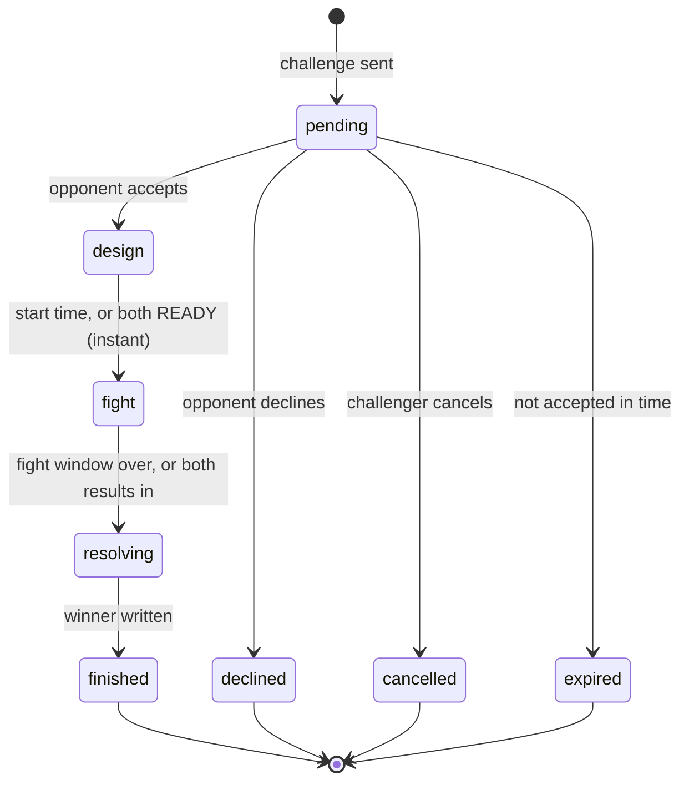

# Battles

A battle is a one-on-one fight between two commanders. Each of you designs your city until a start
time, both cities are then **locked**, and each of you gets **one raid** on the other's locked
city. The better raid wins trophies.

This page covers the rules as the game enforces them. Every number here comes from
`src/shared/battleRules.js`, and the Firestore rules (`firestore.rules`) re-check the same numbers
on the server. How to turn online play on is in [ONLINE.md](ONLINE.md). The AI designer is covered
in [MCP.md](MCP.md).

- [The short version](#the-short-version)
- [Before your first battle](#before-your-first-battle)
- [Instant or scheduled](#instant-or-scheduled)
- [The phases](#the-phases)
- [Timelines and deadlines](#timelines-and-deadlines)
- [Designing before the lock](#designing-before-the-lock)
- [The raid](#the-raid)
- [Scoring and tie-breaks](#scoring-and-tie-breaks)
- [Trophies and your record](#trophies-and-your-record)
- [What you can win and lose](#what-you-can-win-and-lose)
- [Limits](#limits)
- [FAQ](#faq)

## The short version

1. Open **🏆 BATTLES** (home screen dock, under ATTACK CITY) and go to **🎯 Challenge**. Pick a
   rival, choose **⚡ INSTANT** or **📅 SCHEDULED**, and press **⚔️ SEND CHALLENGE**.
2. Your rival presses **✅ ACCEPT** on their Active tab.
3. Both of you design your cities in the **DESIGN MAP**, by hand or with your AI designer. A banner
   over the Design Map counts down to the lock.
4. At the start time both cities lock. Press **⚔️ ATTACK \<name\>** on the battle card and raid
   their locked city. You get one attempt, with a 10-minute raid clock.
5. As soon as the winner is certain (both results in, or the fight window is over and no raid
   still owes its result, or the 11-minute grace runs out), the battle resolves. The winner gets
   **+30 trophies** and the loser **-20** (never below 0); a draw gives both **+5**. If **nobody**
   raided, the battle is **void**: no trophies and no record change for either player.

## Before your first battle

- The game must be an **online build**. If ACCOUNT says "Online play is not set up in this
  build", see [ONLINE.md](ONLINE.md#setup-from-zero-a-real-firebase-project).
- **Sign in** (👤 pill in the top bar -> Profile) with email and password or Google, and pick a
  **commander name**: 3-20 letters, digits, spaces, `_` or `-`, unique across the game.
- Signing in uploads your city to your account. That upload is what opponents raid, so keep the
  game open for a few seconds after your first sign-in.
- **Equip at least one card** in the GARAGE. ATTACK refuses to start with an empty deck.
- Your rival must also have signed in once. The Challenge tab lists recent rivals and the players
  seen most recently, and you can search by the start of a name.

## Instant or scheduled

| | ⚡ Instant | 📅 Scheduled |
|---|---|---|
| For | "Fight now" | "Fight tonight at 21:00" |
| Opponent must accept | within **10 min** of the challenge | at least **1 min** before the start time |
| Start time | acceptance + the design time you picked: **None / 2 / 5 / 10 min** (default 5) | the time you picked: **Tonight 21:00**, **Tonight 23:00**, **Tomorrow 21:00**, or any time **10 min to 7 days** ahead |
| Start early | yes: when **both** press **✓ I'M READY**, the start moves to that moment | no, it starts at the booked time |
| Fight window | **15 min** after the lock | **1 hour** after the lock |
| Theme | day or 🌙 night | day or 🌙 night |

**Night theme.** The challenge form switches it on by itself when the start time falls between
**19:00 and 06:00** on the challenger's clock, and you can flip it either way. Night only changes
the look of the raids: moonlight, darker streets, and a headlight on the buggy. Defenses, police
and scoring are identical.

A preset less than 10 minutes away (or already past) is greyed out with the reason shown. A
custom time is checked the same way before the challenge is sent.

## The phases

| Phase | What it means | What you can do |
|---|---|---|
| **pending** | Waiting for the opponent to answer. | Opponent: **✅ ACCEPT** or **✋ DECLINE**. Challenger: **CANCEL CHALLENGE**. |
| **expired / declined / cancelled** | The battle never started. Nothing changes for anyone. | Nothing (it moves to History). |
| **design** | Accepted; both cities are still editable. | **🗺️ DESIGN MY CITY** (opens the Design Map). Instant battles: **✓ I'M READY**. |
| **fight** | Both cities are locked; attacks are open. | **⚔️ ATTACK \<name\>**, once. |
| **resolving** | The fight window is over, or both players have a result. | Wait. The game writes the winner by itself - at once when no raid still owes a result, else when it arrives or the grace ends. |
| **finished** | Winner (or **void**) recorded; trophies are settled by each player's game. | See it in **📜 History** (newest first, by the start time each row shows). |

A battle can only be cancelled or declined while it is **pending**. Once accepted it runs to the
end. Not attacking counts as a raid with no result (see [scoring](#scoring-and-tie-breaks)).

## Timelines and deadlines

An instant battle with 5 minutes of design time, accepted 2 minutes after it was sent (times are
minutes after the challenge):

```mermaid
gantt
    title Instant battle, 5 min design time (hh:mm after the challenge was sent)
    dateFormat HH:mm
    axisFormat %H:%M
    section Challenge
    Opponent may accept (max 10 min)       :p, 00:00, 10m
    Accepted                               :milestone, acc, 00:02, 0m
    section Design
    Both design, drag or AI                :d, 00:02, 5m
    section Fight
    Cities lock                            :milestone, lock, 00:07, 0m
    Fight window, 15 min                   :f, 00:07, 15m
    A raid started at minute 15, max 10 min :r, 00:15, 10m
    section Results
    Late results accepted, 11 min          :g, 00:22, 11m
    Resolved at the latest                 :milestone, res, 00:33, 0m
```

A scheduled battle sent at 18:00 for 21:00:

```mermaid
gantt
    title Scheduled battle for 21:00, sent at 18:00
    dateFormat HH:mm
    axisFormat %H:%M
    section Challenge
    Opponent may accept (until 20:59)      :p, 18:00, 179m
    section Design
    Both design after acceptance           :d, 18:30, 150m
    section Fight
    Cities lock                            :milestone, lock, 21:00, 0m
    Fight window, 1 hour                   :f, 21:00, 60m
    section Results
    Late results accepted, 11 min          :g, 22:00, 11m
```

Every deadline, as the code and the Firestore rules enforce it:

| Rule | Value | Constant in `battleRules.js` |
|---|---|---|
| Instant design time choices | 0, 2, 5, 10 min (default 5) | `INSTANT_DESIGN_OPTIONS`, `INSTANT_DEFAULT_DESIGN` |
| Instant challenge expires | 10 min after it is sent | `INSTANT_RESPOND_SECONDS = 600` |
| Instant fight window | 15 min after the lock | `INSTANT_FIGHT_SECONDS = 900` |
| Scheduled start | at least 10 min, at most 7 days ahead | `SCHEDULED_MIN_LEAD_SECONDS = 600`, `SCHEDULED_MAX_LEAD_SECONDS = 604800` |
| Scheduled accept deadline | 1 min before the start | `SCHEDULED_ACCEPT_BEFORE_SECONDS = 60` |
| Scheduled fight window | 1 hour after the lock | `SCHEDULED_FIGHT_SECONDS = 3600` |
| Raid clock | 10 min from the breach | `RAID_TIME_LIMIT_SECONDS = 600` |
| Last moment to start a raid | 30 s before the fight window ends (a gate must be picked by the end) | `ATTACK_CUTOFF_SECONDS = 30` |
| Late results | accepted until 11 min after the fight window ends | `RESULT_GRACE_SECONDS = 660` |
| Locking the opponent's city | only 15 s after the start (their own game locks it first) | `LOCK_GRACE_SECONDS = 15` |
| Open battles per player | 5: battles in design or fight + challenges **you sent** that are pending | `MAX_OPEN_BATTLES = 5` |
| New challenges | one every 10 s per player (the server enforces it for every challenge, also one sent in a batch) | `CHALLENGE_COOLDOWN_SECONDS = 10` |
| Challenge message | 140 characters | `MESSAGE_MAX = 140` |
| Night hours | 19:00 to 06:00, local time | `NIGHT_START_HOUR = 19`, `NIGHT_END_HOUR = 6` |
| Clock tolerance | the server accepts client times within 2 min | `TIME_SLACK_SECONDS = 120` |

All phase changes are judged by the **server's clock**. The game measures how far your computer's
clock is off once per session and corrects its countdowns, so a wrong system clock does not cost
you the battle. The form checks the scheduled start strictly (10 min); the server accepts 2 min of
clock difference on top.

## Designing before the lock

From acceptance until the start time, both cities are live and editable. Whatever your city looks
like **at the start time** is what your opponent raids.

- **By hand**: DESIGN MAP. The banner above the inventory drawer reads
  "🛡️ Battle vs \<name\> locks in mm:ss - design here or ask your AI designer (MCP)".
- **With an AI**: connect Claude (or any MCP client) with a personal token and ask, for example,
  *"Fortify my city for tonight's battle"*. Its edits appear live in your open game. See
  [MCP.md](MCP.md).
- The shop, upgrades and builders work as usual during the design phase. The AI can only arrange
  what you already own, so buy and upgrade first, then design.
- **Instant battles**: when you are done, press **✓ I'M READY**. When both players are ready the
  fight starts at once. Pressing READY first sends any change your game has not uploaded yet, so
  the lock holds exactly what you designed.

**The lock.** At the start time a copy of each city is written into the battle (its *snapshot*).
The server only accepts a snapshot that is byte-for-byte equal to that player's saved city, so
nobody can hand their opponent a fake, easier city. **Your own game locks your city** a few
seconds after the start time, after first uploading any change it has not sent yet, so the lock
holds what you designed up to the start. (The MCP server also locks it just before it saves an AI
edit made after the start.) Your opponent's game may lock your city only if yours has not done it
**15 seconds** after the start (you are offline); then it copies your last saved city. After the
lock you can keep editing your city. That changes your live city and future battles, never the
locked copy.

## The raid

Press **⚔️ ATTACK \<name\>** on the battle card during the fight window. In the last 30 seconds
of the window there is no ATTACK button any more ("Too late to start a raid"): there would be no
time to scout and pick a gate. The card, the dock badge and the Design Map banner change at that
moment by themselves (the game redraws at every deadline, not only when the battle changes), and
an ATTACK pressed too late says "Too late: the fight window closes in N s". If you have no cards equipped, ATTACK opens the garage's Cards tab;
its button then reads **⚔️ ATTACK \<name\>** and starts this battle's raid (BACK returns to
BATTLES).

1. **Recon.** The opponent's locked city loads into a separate arena. Your own city is hidden, not
   replaced, so nothing that happens in the raid can touch your city or your save. **ABORT RECON**
   now costs nothing: your attempt is still unused. You must pick a gate **before the fight window
   closes**: when that is sooner than the 10-minute raid clock, the pill counts down "PICK A GATE
   WITHIN m:ss", and at 0:00 the recon ends by itself ("The fight window closed - this battle can
   no longer be attacked"), with no attempt used.
2. **Breach.** Choosing a gate **uses your one attempt**. From here the raid counts.
3. **Combat.** Normal raid rules, with three differences:
   - A **10-minute clock** runs on the HUD ("BATTLE vs \<name\>"). It turns red in the last minute,
     and at 0:00 the raid ends as **TIME'S UP** with whatever you razed so far. The clock is wall
     time, so a hidden or throttled tab cannot stretch it.
   - **Your buggy is yours.** Tuning, cannon and card deck come from *your* Vehicle and Weapons
     Labs and garage, never from the city you are raiding.
   - **Their city is theirs.** Defenses, police cap, loot and gem bounty come from the locked city
     and its Town Hall.
   - Lives work as in a practice raid: 3 per raid, plus the spares you bought in the garage. A
     spare you actually use is gone, as in a practice raid.
4. **Result.** The moment the raid ends (victory, **🏳️ EXIT RAID**, wrecked, busted or time's
   up), your score is sent. The result screen shows "BATTLE vs \<name\>", your raid time, and
   "Result sent ✓". If the network is down it shows "⚠ Result not sent (retrying)": the result is
   kept on this device and re-sent about every 10 seconds, also after a reload, until the
   late-result window closes. If the
   battle can no longer take it (your breach reached the server after the fight window closed - you
   are told at the breach - or the battle already closed), it says "✗ Not counted" instead of
   retrying.
   **RETURN TO CITY** brings back your own city and reopens BATTLES.

A practice raid (**ATTACK CITY** on the home screen) is unchanged: a daylight raid on your own
city, with no effect on any battle.

## Scoring and tie-breaks

Each raid scores **stars**, **destruction %** and **raid time** (seconds from the breach to the
end, 10 min at most).

| Destruction | Stars |
|---|---|
| under 25% | 0 |
| 25% to 59% | 1 |
| 60% to 94% | 2 |
| 95% or more | 3 |

The winner is decided in this order:

1. **More stars** wins.
2. Same stars: **higher destruction %** wins.
3. Same %: **the faster raid** (lower raid time) wins.
4. Still equal: **draw**.

A player with **no result** (never attacked, closed the tab mid-raid, or the result never arrived)
scores 0 stars, 0% and an infinitely slow time. Any raid that reaches 0 stars and 0% but has a
finite time therefore beats no raid at all. If **neither** player has a result, the battle is
**void**: nobody raided, so nobody gains or loses trophies and neither record changes. (It used to
be a draw worth +5 each, which two idle players could farm.)

Examples:

| You | Opponent | Result |
|---|---|---|
| 2★ 75% in 4:10 | 1★ 58% in 0:50 | You win (more stars) |
| 2★ 75% in 4:10 | 2★ 62% in 1:30 | You win (same stars, higher %) |
| 3★ 100% in 6:00 | 3★ 100% in 5:12 | Opponent wins (faster) |
| 0★ 10% | no result | You win (10% beats 0%) |
| 0★ 0% in 0:40 | no result | You win (a finite time beats none) |
| no result | no result | **Void** (no trophies, no record change) |

The winner is computed by the same function in the game (`decideWinner`), and the Firestore
rules re-compute it and refuse any other winner.

## Trophies and your record

| Outcome | Trophies | Record |
|---|---|---|
| Win | **+30** | +1 win |
| Loss | **-20** (never below 0) | +1 loss |
| Draw | **+5** | +1 draw |
| Void (nobody raided) | 0 | nothing |

Each player's game applies their own change once the battle is finished ("settles" it). This
happens by itself the next time your game is open and signed in, and the toast and History show
what was really applied: a loss at 0 trophies reads "Defeat (no trophies to lose)" and "±0 🏆
already at 0", not "-20". The server only lets a record change as the settle of a finished
battle, for the outcome that battle's winner gives you, once per battle. Your trophies show on the
account pill ("Alice · 🏆30") and on the BATTLES screen.

## What you can win and lose

Battles are for glory.

- **You win**: trophies and your record. Your raid also pays the same **loot** and **gems** a
  practice raid would, computed on the opponent's locked city: resources for every building you
  destroy, and the victory gem bounty of **their** Town Hall (scaled, as always, by how complete
  their defense was). This loot is new, created by the raid.
- **Your opponent loses nothing but trophies.** Their bank, vaults and city are never touched by
  your raid. The same is true for you when they raid your city.
- **You spend** the spare lives you use during the raid, exactly as in a practice raid.

## Limits

- At most **5 open battles** at once: battles in design or fight, plus challenges **you sent**
  that are still pending. Challenges sent **to** you do not count, so you can always accept one
  (the accepted battle then counts). The form says so when you are at the limit.
- One new challenge every **10 seconds** per player. The server checks every single challenge: each
  one must carry its own fresh timestamp, so a modified client cannot send many in one write.
- The message is at most 140 characters and is shown to your opponent on the challenge card.
- You cannot challenge yourself or a player who has no profile.

## FAQ

**My opponent never answered.** An instant challenge expires 10 minutes after it was sent, a
scheduled one 1 minute before its start. Nothing is lost; it goes to History as expired.

**My opponent accepted but never attacked.** Attack anyway. Any raid beats no raid (see
[scoring](#scoring-and-tie-breaks)). If your opponent never started a raid, the battle resolves
as soon as the fight window ends; if they started one, it waits for their result (at most 11
minutes after the window). If neither of you attacks, the battle is void.

**Does my game have to be open at the start time?** No. Your own game locks your city at the
start time if it is open; if it is not, your opponent's game locks your last saved city 15 seconds
after the start (and an AI edit saved after the start locks the city as it was before that edit).
Resolving happens the next time either game is open, and each player's game settles their own
trophies the next time it is open. The game shows toasts only while it is open; there are no push
notifications.

**I closed the tab during my raid.** Your attempt was used at the breach, and no result was
produced, so you count as "no result". Your card then says "✗ Raid interrupted (page closed) -
counts as no raid", and your opponent's says "raid interrupted (no result)" once your raid clock
would have run out. A raid that is still running somewhere else is shown as such: another tab of
the same browser shows "⏳ raid in progress in another tab" (and "interrupted" as soon as that tab
is closed or reloaded), another device "⏳ raid in progress on another device" until the raid clock
plus a minute has passed, then "✗ Raid interrupted (no result)". After the fight window, while a
raid still owes its result, the card says whether the winner waits for a raid in progress or only
for the results to close. A result that *was* produced (the result screen appeared)
is saved on the device and re-sent the next time the game is open, until 11 minutes after the
fight window ends.

**ATTACK right after the start shows "PREPARING RAID…" for a few seconds.** Your opponent's game
locks their city a few seconds after the start time; yours waits for it (at most 15 seconds, then
it locks their saved city itself) so you raid what they designed. Meanwhile the card reads
"Cities: 🔒 yours · waiting for \<name\>'s city to lock (up to 15 s)", and the "🔒 Battle vs
\<name\> is live: cities are locked" toast comes once both cities really are locked.

**Can I change my city after the lock?** Yes. You change your live city and future battles; the
locked copy your opponent raids stays as it was at the start time.

**Can my AI designer attack, accept or buy for me?** No. MCP tokens are design-only: place, move,
stow, clear trees, draw and erase roads. Everything else is manual.

**Can a few seconds of edits slip past the lock?** Yes, in theory. There is no server process that
freezes cities at an exact instant (the game runs on the free Firebase plan, with no Cloud
Functions). The first snapshot written after the start time is the lock, so an edit saved in the
few seconds between the start time and that write is part of it.

**Can a loser just never settle?** Yes: settling is done by each player's own game, so a modified
client can skip its -20. What it cannot do is award itself trophies or wins: the server accepts a
win, loss or draw only as the settle of a finished battle it was in, for that battle's outcome,
once.

**Can someone fake a score?** A modified game client could report a better raid than it played.
The server checks everything it can (timing, one attempt, one result, stars must match the %,
the % must match buildings destroyed / total, the winner must follow the stored results), but it
does not replay the raid. See the trust model in [ONLINE.md](ONLINE.md#security-and-trust-model).

**Which clock decides "tonight"?** Scheduled times are shown in each player's own time zone. The
automatic night theme uses the challenger's local hour when the challenge is created.
