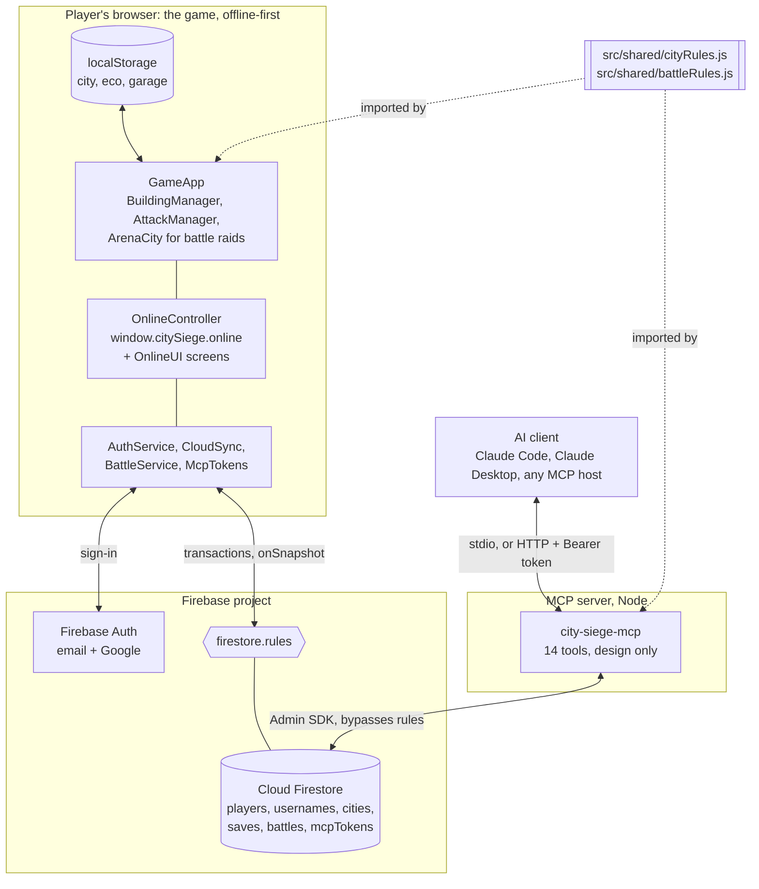
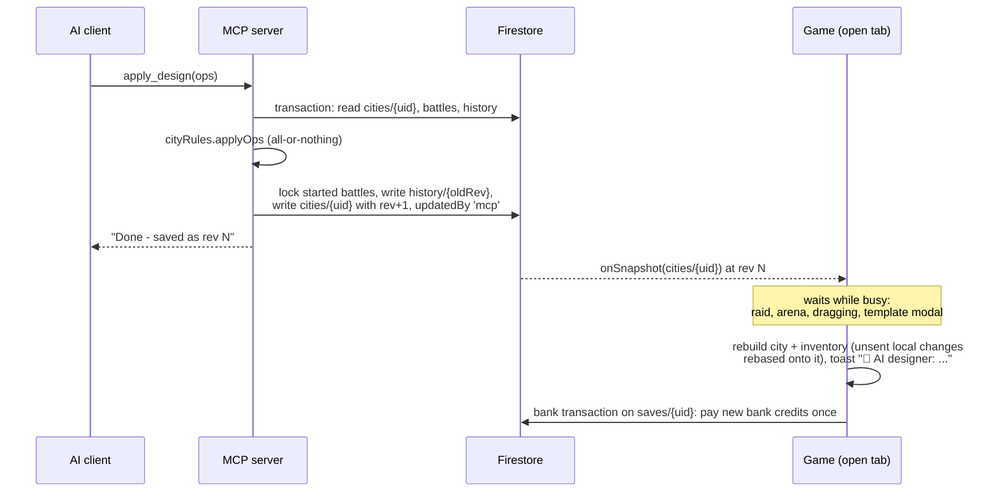
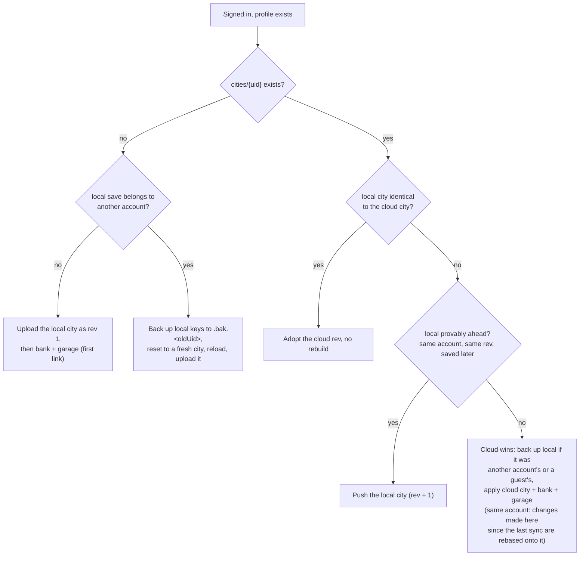

# City Siege online: setup and architecture

Online play adds four things to the game: **accounts** (Firebase Authentication), a **cloud save**
of every player's city, bank and garage (Cloud Firestore), **PvP battles**, and an **AI designer**
that edits your city through MCP. It is an optional layer. A build without Firebase settings plays
fully offline, exactly as before, and never downloads the Firebase SDK.

Related docs: [BATTLES.md](BATTLES.md) (the rules players see), [MCP.md](MCP.md) (the AI
designer), [`mcp-server/README.md`](../mcp-server/README.md) (running the MCP server),
[CHATGPT.md](CHATGPT.md) (connecting ChatGPT with OAuth),
[ONLINE_SPEC.md](ONLINE_SPEC.md) (the engineering contract and its deviations log, section 13).

- [Architecture](#architecture)
- [Code map](#code-map)
- [Data model](#data-model)
- [Sync model](#sync-model)
- [PvP arena model](#pvp-arena-model)
- [Security and trust model](#security-and-trust-model)
- [Known limitations](#known-limitations)
- [This repo's live project: `shadow-duel-dark-2026`](#this-repos-live-project-shadow-duel-dark-2026-shared-with-shadow-duel)
- [Setup from zero: a real Firebase project](#setup-from-zero-a-real-firebase-project)
- [Local development with the emulators](#local-development-with-the-emulators)
- [Testing](#testing)
- [Environment variables](#environment-variables)
- [Troubleshooting](#troubleshooting)

## Architecture



- **The game** boots from localStorage as it always has. After boot, `OnlineController` loads
  Firebase (lazily, only in a configured build), follows the sign-in state and **links** the local
  save to the account. From then on every local save is also pushed to Firestore, and changes made
  elsewhere (the AI designer, another device) arrive live.
- **Firestore** holds everything shared. `firestore.rules` is the only server-side logic: there are
  no Cloud Functions, so the project runs on the free Spark plan.
- **The MCP server** is the only writer besides the players' own games. It uses the Firebase Admin
  SDK, which bypasses the rules, so it validates every edit with the same pure rules module the
  game's Design screen follows (`src/shared/cityRules.js`) before writing.
- **The shared modules** are plain JavaScript with no browser or Firebase imports. They run in the
  game, in the MCP server and in the Node tests. `firestore.rules` repeats the battle numbers and
  the winner calculation, and `tools/online/test-firestore-rules.mjs` fails if they drift apart.

An AI edit, end to end:



## Code map

| File | Role |
|---|---|
| `src/net/firebase.js` | The only door to the Firebase SDK. `isOnlineConfigured()`, `onlineConfig()`, lazy `loadFirebase()`, emulator wiring. |
| `src/net/OnlineController.js` | Owns the four services, exposes `window.citySiege.online`. Its header documents the full public API and events. |
| `src/net/AuthService.js` | Email/password and Google sign-in, commander name claim, live profile, friendly error messages. |
| `src/net/CloudSync.js` | City + holdings + bank + garage to and from Firestore: link, push, live remote apply, bank credits, presence, server clock offset. |
| `src/net/cityMerge.js` | Pure three-way merges: rebasing this device's unsynced changes onto a newer cloud city, and the bank + garage merge. |
| `src/net/BattleService.js` | Challenges and every battle transition, the automatic lock/resolve/settle loop, the result retry queue, player search. |
| `src/net/McpTokens.js` | Generate (`csk_` + 32 random bytes), list, revoke and delete AI designer tokens. Stores only the SHA-256. |
| `src/combat/ArenaCity.js` | The second, hook-free BuildingManager + RoadNetwork a battle raid happens in. |
| `src/combat/AttackManager.js` | `startBattleRaid()`: battle raids, the 10-minute clock, attempt and result callbacks. |
| `src/ui/OnlineUI.js` | Account pill, ACCOUNT and BATTLES full screens, Design Map banner, dock badge. |
| `src/shared/cityRules.js` | The city layout as plain data: cloud encoding, the six design ops, text map, audit, defense report. |
| `src/shared/battleRules.js` | Battle timing, phases, winner, trophies, schedule presets, challenge validation. |
| `firestore.rules`, `firestore.indexes.json` | Security rules (header explains the trust model) and composite indexes. |
| `firebase.json`, `.firebaserc` | Rules/indexes paths and emulator ports; the default project is the emulator-only `demo-city-siege`, alias `prod` = `shadow-duel-dark-2026`. |
| `.env.example`, `.env.emulator` | Documented `VITE_*` variables; committed emulator config for `vite --mode emulator`. |
| `mcp-server/` | The MCP server (own `package.json`, Dockerfile, tests). See [MCP.md](MCP.md). |
| `tools/online/` | Node tests and the real-game fixtures (see [Testing](#testing)). |

## Data model

All documents live in the project's default Firestore database. "Owner" means
`request.auth.uid == {uid}`. Timestamps compared with the server clock are written with
`serverTimestamp()`.

### `players/{uid}`: public profile

| Field | Type | Notes |
|---|---|---|
| `uid` | string | = document id |
| `name` | string | commander name, 3-20 of `[A-Za-z0-9_ -]`, no edge spaces |
| `nameLower` | string | `name.toLowerCase()`, used for search and uniqueness |
| `townHall` | int 1-12 | refreshed by presence |
| `trophies`, `wins`, `losses`, `draws` | int >= 0 | start at 0; change only in settle steps |
| `createdAt`, `lastSeen` | timestamp | `lastSeen` written every 60 s while the tab is visible |
| `lastSettled` | string, optional | id of the battle the last W/L/D tick settled |
| `lastChallengeAt` | timestamp, optional | server time of the last challenge sent (the 10 s cooldown) |
| `lastChallengeId` | string, optional | id of the battle that stamp was spent on (moves only with a new `lastChallengeAt`) |

Read: any signed-in player (search, battle cards). Create/update: owner only; a new or changed
name needs the matching `usernames` claim. Trophies can only move by one settle step per write: one of
wins/losses/draws +1 with trophies +30, `max(0, t-20)` or +5, and only as the settle of the finished
battle named in `lastSettled`, in the same transaction that sets that battle's `settled.{uid}`, for
the counter its winner gives this player (so a console `updateDoc` cannot award wins). Delete: never.

### `usernames/{nameLower}`: name claims

`{ uid }`. Created only if absent, so two players racing for a name get exactly one winner.
Deleted only by its owner, and only once their profile no longer uses it (a rename is one batch:
new claim + profile update + old claim delete). `get` by any signed-in player, no `list`.

### `cities/{uid}`: the live city

| Field | Type | Notes |
|---|---|---|
| `uid`, `name` | string | name <= 40 |
| `townHall` | int 1-12 | |
| `rev` | int | every write is exactly `rev + 1`: how CloudSync and the MCP server detect races |
| `updatedAt` | timestamp | |
| `updatedBy` | `'game'` or `'mcp'` | the rules only let a client write `'game'` |
| `writerId` | string | the game's per-page-load session id, or `mcp:<first 8 hex of the token hash>` |
| `writers` | list (<= 8) | tokens (`<session id>.<n>`) of the latest game writes; the MCP server leaves it as it is. How a push whose reply was lost is recognised (see [Pushing local changes](#pushing-local-changes)) |
| `layout` | map | `{ v: 1, savedAt, buildings[], tasks[], roads[] }` (below) |
| `holdings` | map | `{ inventory, stowedCounts, stowedLevels, stowedSealed, bankCredits }` |
| `lastChange` | map | `{ by, summary (<= 200), at }`; the game's toast shows an MCP summary |

`layout` is the local save blob (`city_siege_city`) in cloud form:

- `buildings[]`: `{ id, t, gx, gz, l, st, rot, gate? }`: stable id, type, tile, level, stored
  output, rotation (radians).
- `tasks[]`: `{ i, id, t, gx, gz, to, endsAt, total }`: running build/upgrade jobs as end times.
- `roads[]`: strings `"gx,gz"` (Firestore does not allow arrays inside arrays).
- `savedAt`: the production clock: each producer's `st` is what it held at `savedAt`, and the game
  credits the time since then. Every writer moves both together (the MCP server advances `st` to
  now and stamps `savedAt` = now on each edit).

Limits enforced by the rules: at most 400 buildings, 400 tasks and 450 road tiles. Read: any
signed-in player (opponents can scout). Write: owner, `updatedBy: 'game'`, `rev == old rev + 1`.
Delete: never.

`cities/{uid}/history/{rev}`: previous versions written by the MCP server for
`undo_last_change` (the latest 20 are kept). Owner can read; nobody writes through the rules.

### `saves/{uid}`: bank and garage (private)

`{ bank: { cash, iron, wood, gems, vehicleLives }, garage: {...GarageManager state...}, credited?, writers?, updatedAt }`.
Owner only. Bank values must be numbers >= 0. `credited` (a list of at most 100 ids) names the AI
designer's bank credits this bank has already been paid (see [Bank credits](#bank-credits)).
`writers` (a list of at most 8) holds the tokens of the latest bank writes, like `cities.writers`.

### `mcpTokens/{sha256}`: AI designer tokens

`{ uid, label (<= 40), createdAt, revoked: false, scope: 'design', lastUsedAt?, uses? }`. The id
is the SHA-256 (64 lowercase hex) of the raw token; the token itself is never stored. The owner
can create, get/list their own, rename, revoke (never un-revoke) and delete. `lastUsedAt` and
`uses` are written only by the MCP server.

An app connected with OAuth (ChatGPT, [CHATGPT.md](CHATGPT.md)) is one doc here too, written by the
MCP server: id = a random 64-hex grant id, `kind: 'oauth'`, `label` = the app's name, plus
`clientId`, `clientName`, `redirectHost`, `resource`, and SHA-256 hashes of the current access and
refresh secrets with their expiry (`accessHash`, `accessExpiresAt`, `refreshHash`, `refreshExpiresAt`,
`prevRefreshHash`, `rotatedAt`). The game lists it as "🔗 <app> · signed in"; Revoke / Delete work
the same as for a token.

### OAuth collections (`oauthClients`, `oauthRequests`, `oauthApprovals`, `oauthCodes`)

Used only while an app connects (`mcp-server/src/oauth.js`, [CHATGPT.md](CHATGPT.md#how-it-works)).
`oauthClients/{clientId}` (registered apps), `oauthCodes/{sha256}` (one-time codes, 5 min) and the
writes to `oauthRequests/{id}` (a parked authorization request, 10 min) are server-only. A signed-in
player may **get** an `oauthRequests` doc by its unguessable id (the CONNECT screen), and create
`oauthApprovals/{id}` = `{ uid: <own uid>, approvedAt: serverTimestamp() }` once, while that request
is open. Nothing else is readable or writable by clients.

### `battles/{battleId}`

| Field | Notes |
|---|---|
| `mode`, `theme` | `'instant'` or `'scheduled'`; `'day'` or `'night'` |
| `status` | `'pending'`, `'accepted'`, `'declined'`, `'cancelled'`, `'finished'` |
| `challenger`, `opponent`, `players` | uids; `players = [challenger, opponent]` (list queries use `array-contains`) |
| `names`, `townHalls` | per uid |
| `message` | optional, <= 140 chars |
| `createdAt`, `acceptedAt` | server timestamps |
| `designSeconds` | instant: 0, 120, 300 or 600 |
| `startAt`, `fightEndsAt` | scheduled: set at create; instant: set at accept (and pulled to now when both are ready) |
| `ready.{uid}` | instant only |
| `snapshots.{uid}` | `{ layout, townHall, name, rev, lockedAt }`: the locked city, equal to `cities/{uid}` when written |
| `attempts.{uid}` | `{ startedAt }`: the one attempt, written at the breach |
| `results.{uid}` | `{ stars, percentage, destroyed, total, outcome, durationSec, loot: {cash, iron, wood}, finishedAt }` |
| `winner`, `resolvedAt` | uid, `'draw'`, or `'void'` (nobody has a result: no trophies, no record change) |
| `settled.{uid}` | `true` once that player's side is settled |
| `trophyChange.{uid}` | int: the trophies settle really moved for that player (a loss at 0 moves 0; void 0) |

The battle id must match `[A-Za-z0-9_-]{1,64}` (auto-ids do), and a challenge is created in one
batch with the challenger's `players.lastChallengeAt` stamp and `lastChallengeId` = the new battle's
id: one challenge per 10 s, and one per stamp (a batch of several challenges with one stamp is
refused).

Only the two players can read it. Each update must be exactly one transition (create, accept,
decline, cancel, ready, snapshot, attempt, result, resolve, settle), each limited to the keys it
may change and checked against the server clock. See [BATTLES.md](BATTLES.md) for the timing.

### Indexes (`firestore.indexes.json`)

- `battles`: `players` array-contains + `createdAt` descending (the battle list; the MCP server's
  battle lookup uses it too).
- `mcpTokens`: `uid` ascending + `createdAt` descending (the token list).

Player search (`nameLower` range) and "recently seen" (`lastSeen` descending) use Firestore's
automatic single-field indexes.

### Local keys (browser)

| Key | Holds |
|---|---|
| `city_siege_city`, `city_siege_eco`, `city_siege_garage` | the three game saves, unchanged by online play (buildings now also carry their `id`) |
| `city_siege_cloud` | link meta: `{ uid, syncedRev, creditedIds (last 100), linkedAt, bankHash, bankBase, pendingCredits?, bankDoubt?, fresh? }` (where the last page load left off; each open tab keeps its own copy in memory). `bankDoubt` is a bank write whose reply never came |
| `city_siege_cloud_base` | the cloud city (layout + holdings + rev) this browser last synced: what "changed here" is measured against when a newer cloud city arrives |
| `city_siege_cloud_doubt` | city pushes whose reply has not come yet (`{ uid, list: [{ token, rev, layout, holdings }] }`), so a reload can still recognise one that landed |
| `city_siege_guest_backup` | set when signing in replaced a guest city: `{ uid, townHall, buildings, roads, cash, ... }` for the ACCOUNT screen's "Restore guest city" (the save itself is `<key>.bak.guest`) |
| `city_siege_battle_results` | battle results waiting to be sent (retried about every 10 s until the late-result window closes) |
| `city_siege_battle_raids` | battle raids running in this browser, `{ battleId: { uid, beat, dead? } }`: the raiding page beats every 5 s and marks its raid `dead` when it closes or reloads, so the other tabs show "in progress in another tab" or "interrupted" |
| `<key>.bak.<uid>`, `<key>.bak.guest` | backups made when another account takes over this device |

Firebase Auth keeps the sign-in in IndexedDB, so a reload stays signed in.

## Sync model

### Offline-first

The game always boots from localStorage, synchronously, with or without a network. Online play is
applied on top, after boot, and never blocks it. Signing out stops syncing; the local save stays
and the game keeps working offline.

### Linking on sign-in



- A guest who plays offline and then creates an account keeps their city: the first link uploads
  it (same building ids).
- A guest who signs into an account that already has a city gets the account's city; the guest city
  is kept on the device (`city_siege_*.bak.guest`) and ACCOUNT › Profile offers **Restore guest
  city** (it becomes the account's city; the account's previous one is kept as `.bak.<uid>`) or
  **Keep my account's city**. The sign-in toast says so.
- A second account on the same device gets a fresh default city. The first account's saves are
  kept in `city_siege_*.bak.<uid>`, and signing back into it downloads its cloud city. An account
  whose `saves/` doc is missing starts from the starter bank, never the previous account's.
- Link failures (offline, flaky network) retry with backoff (3 s up to 90 s) and on the browser's
  `online` event. The cloud status dot shows the state.

### Pushing local changes

`saveCityNow()` in `main.js` is the single funnel for city saves. When linked, each save schedules a
push **1.5 s** later (debounced), but a stream of edits (a road drawn tile by tile) never holds it
back more than **3 s**. A change that moved value between the bank and the city - a purchase, an
upgrade's cost, a collect, a gem finish - is pushed at once, and a hidden tab pushes immediately.
A push is a transaction:

1. Read `cities/{uid}`. If its `rev` is not the rev this page last synced, someone else wrote
   first (the AI designer, another device, another tab). The push writes nothing; the newer cloud
   city is applied with this device's unsynced changes **rebased** onto it (see
   [Applying remote changes](#applying-remote-changes)), and the result is pushed on top of it.
2. Otherwise write the whole city with `rev + 1`, `updatedBy: 'game'`, this page load's
   `writerId`, and the push's token appended to `writers`.

**A reply that never comes.** A connection can drop after a write reached the cloud but before its
reply came back. The Firestore SDK then runs the transaction again, or it gives up. Either way the
write may have landed. Each game write therefore appends a token to the doc's `writers` list (the
latest 8 are kept; the MCP server does not touch the list). The next time the game reads that doc,
the token tells whether the write landed, even if an AI edit or another device's write came on top
of it:
- A landed city push becomes the version this device last synced. A remote edit on top of it is not
  rebased against the older version, which would add the purchases a second time.
- A landed bank write is adopted, not merged in again as another device's change. Merging it again
  applied every collect or spend twice.
Pushes whose reply is still missing are kept in `city_siege_cloud_doubt` and `city_siege_cloud`
(`bankDoubt`), so a reload settles them too.

Each open tab keeps the rev it last synced in memory, so two tabs of one account are two writers
that see and merge each other's pushes (they used to share it through localStorage, and one tab
could overwrite the other's change without a conflict).

**At sign-in or reload** the local city is pushed when nobody else wrote since this device last
synced (the cloud's `rev` is still the one this device last synced) and the local city differs from
it. This no longer depends on comparing `savedAt` values. The MCP server stamps `savedAt` with its
own clock, so on a device whose clock was behind, unsent changes were thrown away while their cost
stayed spent.

**Echo suppression.** A push only writes when the city actually differs from what is known to be in
the cloud: buildings, jobs, roads, holdings, or a producer holding *less* output than the cloud copy
implies by now (its `st` at the cloud's `savedAt` plus production since - it was collected). Output
merely growing is not a reason to write. This is also why applying an AI edit does not push it
straight back: the document stays `updatedBy: 'mcp'`, which keeps `undo_last_change` working. The
exception is an AI edit that arrives while this device has unsent changes of its own: the two are
merged (below) and the result is pushed as `updatedBy: 'game'`, which ends that undo chain.

The bank and garage go to `saves/{uid}` **3 s** after an economy or garage save (never more than
8 s late), skipped when unchanged. That write is a transaction too: if another device changed the
bank since this device last synced it, the result is theirs plus this device's changes since then
(spends and incomes on both survive), not a plain overwrite. Every device also follows `saves/{uid}`
live, so a spend on one shows on the other within a second.

Pushes pause while persistence is suspended, while a remote city is being applied, during an
account switch, and while signed out.

### Applying remote changes

The game listens to `cities/{uid}`. A new rev written by anyone else is applied as soon as the game
is **not busy**: no raid in progress (practice or battle), no arena loaded, no building in the
player's hand, no template modal open, persistence not suspended. While busy it waits and retries every 500 ms (the cloud dot
shows "Syncing…" and the profile card "A cloud change is waiting until you finish (raid)").

Applying rebuilds the city (`restoreCity`), the inventory and storage (`holdings`), queues new bank
credits for the bank transaction (see [Bank credits](#bank-credits)), saves locally, refreshes the
open screens and shows a toast: "🤖 AI designer: \<summary\>"
for MCP edits, "☁️ Your city was updated from another device." for game edits.

**Rebase.** If this device has changes the cloud has not seen yet (the push window, or a whole
offline session - also after a reload, from `city_siege_cloud_base`), they are not thrown away:

- **Design follows the cloud version**: which buildings stand where and the roads. Then the design
  edits made here that the other side left alone are replayed, with the same checks the AI
  designer's edits pass (radius, overlap, inventory, limits):
  - road tiles drawn or erased;
  - buildings moved or turned;
  - buildings stowed. They go into storage at the level they reached here. If storage is full they
    stand again, at that level.
  - buildings placed. They keep their id, level, output and running upgrade.
  A building the AI moved stays where the AI put it. A building placed here whose tile the other
  side took goes back to the inventory, in storage with the levels paid for it. The toast says so:
  "A building you placed here no longer fits and is back in your inventory: place it again."
- **Game state is kept**: levels, running build jobs, what producers still hold (a collect on
  either side stands, so nothing is paid twice) and shop purchases (re-added to the inventory).
  A job started here on a building the other side removed is refunded; a building the AI stowed
  keeps the level it reached here. Per building type, the levels paid for are neither lost nor
  minted.
- **A stow credit never pays output twice.** Say the AI stows a producer whose output this device
  already banked: it collected it, or stowed that same producer itself. That part is taken off the
  credit before the credit is paid. It is never taken from the live bank, where it may already be
  spent.
- The result is pushed at once, and the toast adds "Your own changes here were kept."

### Bank credits

The MCP server cannot touch the bank. When the AI stows a producer that holds output, the game
would normally bank that output, so the server records it in `holdings.bankCredits` instead (an AI
undo that takes a placed producer off the map records one the same way, reason `stow <type>`):
`{ [creditId]: { cash, iron, wood, reason, at } }`. The game pays a credit through its bank
transaction, which also adds the id to `saves/{uid}.credited`: a credit is paid once per account,
whichever device sees it first. The game does not push the city just to clear the map (a game
write would end the AI designer's undo chain): the MCP server drops paid credits on its next write
(it reads `saves/{uid}.credited` in the same transaction), and the game's next real push drops
them too. The toast adds "(+💰N banked from stowed output)".

The bank transaction also reads `cities/{uid}`. How it handles credits:
- It pays a credit only while the city still carries it. A credit leaves the city only once it is
  paid.
- `credited` keeps every paid id the city still carries. It used to keep only the last 100, and
  once the city held more than 100 credits the oldest ones were paid again.
- When `credited` has no room left (100 paid credits still in the city), the rest wait. The game
  then pushes the city, which keeps only the unpaid credits, and pays them. That push ends the AI
  designer's undo chain. In practice it does not happen: every AI write already drops the credits
  `credited` holds, so paid credits cannot pile up while the AI keeps editing.

### Presence and the server clock

While the tab is visible, `players/{uid}.lastSeen` and `townHall` are written every 60 s. The first
write of a session also measures how far the local clock is from the server's; battle countdowns
and client-chosen battle times use the corrected clock.

## PvP arena model

A battle raid never swaps the player's own city out. `ArenaCity` is a second BuildingManager and
RoadNetwork, built on the first battle raid and reused:

- It has **no autosave hooks and no economy**, and is flagged `isForeignCity`, which `saveCity`
  refuses outright. Nothing in the arena can reach `city_siege_city` or the cloud city.
- `enter(snapshot)` checks the locked layout with `cityRules.auditLayout` (refusing only real
  errors), restores it without build jobs, hides the home city and its collectibles, and points
  the buggy at the arena's roads. `leave()` clears the arena and brings everything back.
- `AttackManager.startBattleRaid()` pins the buggy's stats, loadout and card stats from the **home**
  garage and labs before the arena loads, then points the raid at the arena. Defense, police cap,
  loot and gem bounty are read from the arena.
- The attempt is spent when a gate is chosen (`onAttemptStart`); ABORT RECON before that costs
  nothing. The 10-minute clock is wall time from the breach. `onResult` fires exactly once from
  `endAttack`.
- Night battles use `SceneManager.setRaidTheme('night')` and the buggy's headlight; the builder
  view always returns to day.
- CloudSync treats "arena loaded" as busy, so remote edits wait until you are home.

## Security and trust model

What the rules guarantee:

- **Ownership.** You only write your own profile, city, save and tokens, and only your own key
  inside a shared battle.
- **Shape.** Every document has exactly the documented keys, with checked types and ranges.
- **Timing.** Every battle transition happens in its phase, judged by the server clock: challenges
  expire, cities lock at `startAt`, attempts only in the fight window, late results refused.
- **One attempt and one result per player per battle**, never rewritten.
- **Locked-city integrity.** A snapshot must equal the owner's live `cities/{uid}` document when
  it is written, so nobody can hand the opponent a fake, easier city.
- **A deterministic winner.** The rules recompute the winner from the stored results; a resolver
  cannot crown themselves.
- **Trophies** move only in settle-sized steps tied to one W/L/D tick, and every tick is the settle
  of one finished battle the player was in, for that battle's outcome, once. A battle nobody raided
  is void (no change).
- **Unique names** through the `usernames` claims.
- **MCP tokens**: only the SHA-256 is stored; a token works only while its document exists, is not
  revoked and has scope `design`. The MCP server has no tool that attacks, buys, upgrades, collects,
  or touches the bank, `saves/` or the garage (it only reads `saves/{uid}.credited`, field-masked, to
  tell paid stow credits from pending ones).

What they do not guarantee:

- **Raid results are reported by the client.** There is no server-side simulation (that would need
  Cloud Functions and the Blaze plan). A modified client can claim a better raid than it played.
  The rules make lying harder (stars must match the %, the % must match destroyed/total, `victory`
  only at 100%, durations capped), not impossible. Loot and `durationSec` are client-reported too.
- **Trophy farming.** Two accounts working together can play fake battles with fake results; the
  rules only force each trophy change to be the legal settle of a real, finished battle.
- **Settling is voluntary.** Each player's own game settles its side. A modified client can simply
  never settle a lost battle and keep its trophies (it cannot gain any that way).
- **The lock is not instantaneous.** The first snapshot written at or after `startAt` is the lock:
  the owner's game (after uploading its last edits) or the MCP server writes it at once, the
  opponent's game only 15 s later if the owner's has not, so an edit saved in those few seconds is
  part of it.
- **The Firebase web config is public.** It identifies the project; it is not a secret.
  `firestore.rules` is what protects the data.

## Known limitations

- **A device that has not seen another device's spend yet can spend the same money again.** The
  bank merge keeps every spend and income from both devices and floors each resource at 0, so it
  never loses a change, but it cannot refuse one. A device that is offline, or acts in the second
  before the other's spend reaches it live, still shows the old bank: if both spend the last 1,000
  cash, both purchases stand and the bank ends at 0 (the second one was partly free). Simultaneity
  is not needed; a device that stayed offline for an hour has the same window for that hour. There
  is no server to arbitrate; the rules only keep values >= 0.
- **Concurrent design edits: the other side's design wins.** Unsent changes are not only the last
  1.5-3 s push window: a whole offline session, or a reload before the push, is unsent too. When a
  newer cloud version arrives on top of them, this device's road tiles, moves, stows and
  placements are replayed only if they still fit. A building placed here whose tile was taken goes
  back to the inventory with its levels, and the toast says so. Game state (purchases, upgrades,
  collects) is kept - see [Rebase](#applying-remote-changes).
- **Both devices upgraded the same building**, or started a job on it, before either saw the other:
  this device's level and job win and the other device's upgrade on that building is lost. The AI
  designer never upgrades, so this needs two devices (or two tabs).
- **No base, no rebase.** The rebase needs the cloud version this browser last synced for the same
  account (`city_siege_cloud_base`). Without it the cloud city simply wins over unsent changes. That
  happens when an account signed out with changes it could not send (offline), another account then
  used this device, and the first one signs back in: its unsent changes stay only in its
  `.bak.<uid>` backup. It also happens on the first sync of a save made before the rebase existed.
- **No push notifications.** Challenges, lock times and results show as toasts and badges only
  while the game is open. Resolving and settling happen the next time either player's game is open.
- **Open-battle limit (5) is client-enforced.** The rules do not count open battles.
- **Instant challenges expire in 10 minutes**, so both players need the game open.
- **MCP rate limits are per server process.** Several HTTP replicas each allow the full rate.
- **Not exercised in a browser test**: the retry/backoff timings of a long network loss (a drop
  and reconnect, a write whose reply is lost, two devices and two tabs on one account are:
  `tools/online/e2e-sync.mjs`).

## This repo's live project: `shadow-duel-dark-2026` (shared with Shadow Duel)

City Siege runs on the existing Firebase project **`shadow-duel-dark-2026`**, which also hosts the
Shadow Duel game (its android, ios and web apps). The project is on the free Spark plan, and a Spark
project gets one free Firestore database, so both games share the `(default)` database and **one
rules file**:

- `firestore.rules` ends with a **Shadow Duel** block (`entitlements/`, `profiles/`, `rooms/`), copied
  unchanged from the rules Shadow Duel had live (only its helper functions are renamed `sd*`). The
  collections do not overlap with City Siege's. `tools/online/test-firestore-rules.mjs` pins that
  block's behaviour (section "Shadow Duel rules kept intact").
- **Deploy rules from this repo only**: `npm run deploy:rules`. Deploying Shadow Duel's own
  `firestore.rules` would replace this file and switch every City Siege rule off; a Shadow Duel
  rules change belongs in the Shadow Duel block here. Before merging, Shadow Duel's live ruleset
  was `projects/shadow-duel-dark-2026/rulesets/5e2b6a37-18a2-436b-a16e-e75df042af89`; the Rules
  history in the Firebase console can re-release it if ever needed.
- The two games also share one Authentication user pool: an account made in either game can sign in
  to the other.

What is already set up (2026-09-30):

| Piece | State |
|---|---|
| Web app | `city-siege (web)`, app id `1:891020100166:web:380e42c27b0a089f508047` |
| Config | `city-siege-3d/.env.local` (git-ignored), read by `npm run dev` and `npm run build` |
| Rules + indexes | deployed (`npm run deploy:rules`); `.firebaserc` alias `prod` |
| Authentication | **not enabled yet** - see below |
| MCP server | not hosted yet (needs a service account key and a Node host) |

`npm run dev` and `npm run build` use the real project. `npm run dev:emu` (`.env.emulator`) and
`npm run dev:offline` (`.env.offline`, port 3100) override `.env.local`, because Vite's mode files
beat it: run the smoke, raidbot and parity tools against `npm run dev:offline` so they never touch
the real project. Restart Vite after changing any `.env*` file.

Still to do, in the Firebase console (Authentication was never initialized on this project):

1. Build -> Authentication -> **Get started**.
2. Sign-in method -> **Email/Password**: enable. **Google**: enable and pick a support email.
3. Authentication -> Settings -> Authorized domains: add every domain the game will be served from
   (`localhost` is there by default).
4. For the AI designer on the real project: a service account key and a host for the MCP server
   (step 9 below, and [MCP.md](MCP.md#hosting-the-http-server)). Cloud Run needs billing; this
   project has none, so use any Node host.

## Setup from zero: a real Firebase project

You need Node.js 20+, a Google account and the Firebase CLI (`npm install -g firebase-tools`, then
`firebase login`). The game and Firestore fit in the free **Spark** plan.

1. **Create the project.** [console.firebase.google.com](https://console.firebase.google.com) ->
   Add project. Google Analytics is not needed. Note the **project id** (for example
   `city-siege-1a2b3`).
2. **Enable sign-in.** Build -> Authentication -> Get started -> Sign-in method:
   - **Email/Password**: enable (the first switch; "Email link" is not used).
   - **Google**: enable and pick a support email.
3. **Create Firestore.** Build -> Firestore Database -> Create database -> **production mode** ->
   choose a location (it cannot be changed later).
4. **Deploy the rules and indexes** from `city-siege-3d/`:

   ```bash
   cd city-siege-3d
   firebase deploy --only firestore:rules,firestore:indexes --project your-project-id
   ```

   `.firebaserc` names the emulator-only `demo-city-siege` as default, so always pass `--project`
   (or run `firebase use --add` once to add an alias). Indexes take a few minutes to build: watch
   Firestore -> Indexes until both are "Enabled".
5. **Register the web app.** Project settings (gear) -> General -> Your apps -> Add app -> Web
   (`</>`). Hosting is optional here. Copy the config values into `city-siege-3d/.env.local`:

   ```bash
   cp .env.example .env.local
   ```

   | Firebase config key | `.env.local` variable |
   |---|---|
   | `apiKey` | `VITE_FIREBASE_API_KEY` |
   | `authDomain` | `VITE_FIREBASE_AUTH_DOMAIN` |
   | `projectId` | `VITE_FIREBASE_PROJECT_ID` |
   | `appId` | `VITE_FIREBASE_APP_ID` |
   | `storageBucket` | `VITE_FIREBASE_STORAGE_BUCKET` (optional) |
   | `messagingSenderId` | `VITE_FIREBASE_MESSAGING_SENDER_ID` (optional) |

   Keep `VITE_FIREBASE_EMULATORS=false`. Set `VITE_MCP_SERVER_URL` to your hosted MCP server's
   `https://.../mcp` URL once you have one ([MCP.md](MCP.md#hosting-the-http-server)); the ACCOUNT
   screen puts it into the ready-to-paste configs. `.env.local` is git-ignored.
6. **Authorized domains.** Authentication -> Settings -> Authorized domains. `localhost`,
   `<project>.firebaseapp.com` and `<project>.web.app` are there by default. Add every other domain
   the game is served from (your own domain, a LAN IP if you test from a phone), or Google sign-in
   fails with "This site is not an authorised domain".
7. **Run it.** Vite reads `.env*` only at start, so restart it after editing:

   ```bash
   npm install
   npm run dev          # http://localhost:3000 (or: npx vite --port 3100 --strictPort)
   ```

   Open the 👤 pill -> Profile -> create an account. When the pill's cloud dot turns green and the
   profile card reads "Cloud save: Saved to cloud" ("City uploaded to your account"), it works:
   `cities/<uid>`, `players/<uid>` and `saves/<uid>` now exist in the Firestore console.
8. **Build and host.** `npm run build` writes a static site to `dist/` with the config baked in.
   Serve `dist/` from any static host. With Firebase Hosting: `firebase init hosting --project
   your-project-id` (public directory `dist`, not a single-page app, do not overwrite
   `dist/index.html`), then `npm run build && firebase deploy --only hosting --project
   your-project-id`. Note that `dist/` is committed in this repo: a build made with `.env.local`
   puts your project's (public) web config into it.
9. **The AI designer.** Create a service account key for the MCP server (Project settings ->
   Service accounts -> Generate new private key). The console downloads it as
   `<project>-firebase-adminsdk-<id>-<hash>.json`. It bypasses `firestore.rules` for every player, so
   store it **outside the repo** (for example `~/.config/city-siege/`). Inside the repo both that
   name (`city-siege-3d/.gitignore`) and `*service-account*.json` are git-ignored as a safety net,
   but any other name is not. Then host the server: [MCP.md](MCP.md#hosting-the-http-server). Hosting
   it on Cloud Run needs a billing account on the Google Cloud project; any Node host works too.

## Local development with the emulators

No real project and no secrets: `.env.emulator` (committed) points the game at the Firebase
Emulator Suite with the demo project `demo-city-siege`. The Firestore emulator needs Java 11+.

```bash
# terminal 1: auth on 127.0.0.1:9099, firestore on 127.0.0.1:8085
npm run emulators

# terminal 2: the game in emulator mode on http://localhost:3101
npm run dev:emu
```

- The emulator loads `firestore.rules` from `firebase.json` and reloads it when the file changes.
- Data is lost when the emulators stop. To keep it: `firebase emulators:start --only
  auth,firestore --project demo-city-siege --import ./.emulator-data --export-on-exit`.
- **Two players**: use two browser profiles, or a normal and a private window. Each has its own
  localStorage and sign-in.
- Google sign-in works against the auth emulator (it shows a fake account picker).
- **The AI designer against the emulator**: generate a token in the game (ACCOUNT -> AI Designer
  (MCP)), then either paste the "Claude Code - local server (stdio, for the project owner)" snippet the screen shows, or
  run the server by hand:

  ```bash
  FIRESTORE_EMULATOR_HOST=127.0.0.1:8085 FIREBASE_PROJECT_ID=demo-city-siege \
    CITY_SIEGE_TOKEN=csk_... npm run mcp
  ```

- Browser sign-ups always land in the auth emulator's default project (`demo-city-siege`, the one
  `emulators:start --project` names), whatever `VITE_FIREBASE_PROJECT_ID` says; Firestore data does
  follow the project id. Tests that share one emulator should use unique emails.
- Offline mode while a `.env.local` exists: `npm run dev:offline` (port 3100). Its committed
  `.env.offline` blanks the API key, and a mode file wins over `.env.local`.

## Testing

| Command (from `city-siege-3d/`) | Needs | What it proves | Last run |
|---|---|---|---|
| `node tools/verify-progression.mjs` | nothing | progression tables and wiring | ALL PASS |
| `node tools/verify-meshes.mjs` | nothing | building meshes | 18/18 |
| `npm run test:shared` | nothing | `cityRules` + `battleRules` unit tests (void battles, early resolve, production clock, undo output settlement, reach / roads / coverage), ids in `CityPersistence`, `BattleService` views on a fake clock (the next-deadline timer, where a started raid is) | 457 passed |
| `npm run test:sync` | nothing | the rebase (`src/net/cityMerge.js`): purchases, jobs, levels, collects and replayed roads/moves/stows/placements survive a newer cloud city, an AI move wins, a stow credit for output already banked here is held back, the stow-credit ledger pays each credit once past 100, nothing is minted or lost (300 + 3,000 randomised cases with full accounting), the bank merge | 71 passed |
| `npm run test:rules` | Firestore emulator | every allowed and denied write in `firestore.rules`, full instant and scheduled flows, trophy ticks bound to a settled battle, void, lock grace, challenge cooldown, rules constants = `battleRules.js`, the `writers` / `credited` lists, the shared Shadow Duel block unchanged | 463 passed |
| `npm run test:oauth` | Firestore emulator | the OAuth server end to end: metadata (RFC 9728 / 8414), 401 challenges, DCR and client metadata documents (with an SSRF guard), PKCE, iss, resource binding, one-time codes, refresh rotation with a 2 min retry grace, expiry, revoke in the game and via RFC 7009, pasted tokens unchanged - and the official MCP SDK client doing the whole flow by itself with both registration methods | 60 passed |
| `PW_CORE=... GAME_URL=http://localhost:3176/ FIREBASE_PROJECT_ID=demo-cs-oauth-e2e npm run test:e2e:oauth [-- shotsDir]` | both emulators, emulator-mode Vite for the same project | "Connect ChatGPT" in Chrome through the real CONNECT screen: ALLOW back to the app with code + state + iss, token exchange, the app's edits live in the open game, the connection listed and revoked in ACCOUNT, DENY, the signed-out path through ACCOUNT sign-in, an expired link, phone layout | 22 PASS |
| `npm run test:mcp` (or `cd mcp-server && npm test`) | Firestore emulator | every MCP tool over stdio and HTTP, all refusal codes, tokens, unknown-token throttling (per address and /64, the process cap and its quiet lane), rate limits, the 413 body cap, battle lock, undo (with the output of what it takes off the map), paid vs pending credits, the production clock, rules cross-check | 300 passed |
| `npm run test:online` | Firebase CLI, **no emulators running** | the four suites above inside `firebase emulators:exec` (starts and stops its own emulators) | |
| `PW_CORE=... GAME_URL=http://localhost:3100/ node tools/e2e/smoke.mjs [shotsDir]` | offline Vite, Chrome, playwright-core | the whole game in a real browser | 171 PASS |
| `PW_CORE=... GAME_URL=... node tools/e2e/raidbot.mjs --th 2 --runs 1` | offline Vite | scripted raids per Town Hall | TH 2: 1/1 won, 100% |
| `PW_CORE=... GAME_URL=... npm run test:parity [-- shotsDir]` | offline Vite | `cityRules` verdicts = the real Design screen (3,540 probes), ids survive a reload, the MCP production clock = the game's `restoreCity` (48 probes) | PASS |
| `PW_CORE=... GAME_URL=http://localhost:3105/ FIREBASE_PROJECT_ID=demo-cs-e2e npm run test:e2e [-- shotsDir]` | both emulators, emulator-mode Vite for the same project (`VITE_FIREBASE_PROJECT_ID=demo-cs-e2e npx vite --mode emulator --port 3105`), `mcp-server/node_modules` | the whole online game in two Chrome players through the real screens: sign-up + first-link upload, challenge / accept, an MCP token from the ACCOUNT screen driving the real MCP server (stdio) with every edit shown live, a mouse drag pushed and seen by MCP, READY and the auto-lock, raids on the LOCKED snapshots, resolve / settle / History (including a loss at 0 trophies), a network drop mid-raid (result queued, never shown as sent early, delivered after a tab close), token revoke | 84 PASS |
| `PW_CORE=... GAME_URL=http://localhost:3121/ SYNC_PROJECT=demo-cs-sync node tools/online/e2e-sync.mjs [shotsDir]` | both emulators, emulator-mode Vite for the same project (`VITE_FIREBASE_PROJECT_ID=demo-cs-sync npx vite --mode emulator --port 3121`), `mcp-server/node_modules` | the cloud sync in Chrome against the real MCP store: a purchase + an upgrade 200 ms before an AI edit, an offline session rebased on reconnect, the push-conflict path, the push max wait, a second collect, two tabs, two devices (live bank merge), an AI stow paid once and still undoable, guest-city restore, a missing bank doc; review round 2: bank and city writes whose reply is lost (open tab and reload), more than 100 stow credits, offline stows / placements / collects meeting an AI stow, a device clock behind the server's, a placement racing an AI edit (`SYNC_ONLY=K,L` runs chosen scenarios) | 67 PASS |
| `PW_CORE=... GAME_URL=... npm run fixtures` | offline Vite | regenerates `tools/online/fixtures/*.cloud.json` from the real game (new ids every run) | |

`npm run` passes the environment through, so the variables go in front of it as shown, and a
screenshots directory goes after `--`.

Notes:

- The emulator suites use their own project ids so they never wipe each other's data:
  `demo-cs-rules` (override with `RULES_PROJECT_ID`) and `demo-cs-mcp` (`MCP_TEST_PROJECT_ID`). The
  MCP suite's HTTP server uses port 8787 (`MCP_TEST_PORT`). Both read `FIRESTORE_EMULATOR_HOST`
  (default `127.0.0.1:8085`). `RULES_FILE=<path>` runs the rules suite against another rules file.
- `npm run test:online` fails if `npm run emulators` is already running (the ports are taken). With
  emulators up, run `test:shared`, `test:sync`, `test:rules` and `test:mcp` one by one.
- `PW_CORE` is a directory containing `playwright-core` (it is not a project dependency); Chrome must
  be installed. `smoke.mjs` counts every failed request as an error, so run it against an
  **offline** Vite.
- A Vite dev server reloads the page whenever a source file is saved, which breaks a long browser
  suite mid-run. For long runs, start Vite from a config with watching off, for example
  `export default { root: '<path>/city-siege-3d', server: { port: 3115, strictPort: true, hmr: false,
  watch: { ignored: ['**/*'] } } }` and `npx vite --config that-file.mjs`.
- `npm run test:e2e` (`tools/online/e2e-pvp.mjs`) wipes its own Firestore project
  (`FIREBASE_PROJECT_ID`, default `demo-cs-e2e`) and only its own auth users (emails ending
  `E2E_EMAIL_SUFFIX`, default `@e2e-pvp.test`; `e2e-sync.mjs` reads the same variable, default
  `@e2e-sync.test`). Browser sign-ups share one auth pool, so two runs at the same time need
  different suffixes and projects. It loads the real `firestore.rules`, allowlists failed requests
  to the emulator origins, and takes about 100 s. To check the same flow by hand: `npm run emulators`,
  `npm run dev:emu`, two browser profiles, and follow [BATTLES.md](BATTLES.md#the-short-version)
  with a 2-minute instant battle.

## Environment variables

Game (read by Vite from `.env.local` or `.env.emulator`; restart Vite after a change):

| Variable | Default | Meaning |
|---|---|---|
| `VITE_FIREBASE_API_KEY` | empty | Set = online build. Empty and emulators off = offline build. |
| `VITE_FIREBASE_AUTH_DOMAIN` | `<projectId>.firebaseapp.com` | From the web app config. |
| `VITE_FIREBASE_PROJECT_ID` | `demo-city-siege` in emulator mode | From the web app config. |
| `VITE_FIREBASE_APP_ID` | | From the web app config. |
| `VITE_FIREBASE_STORAGE_BUCKET`, `VITE_FIREBASE_MESSAGING_SENDER_ID` | | Optional. |
| `VITE_FIREBASE_EMULATORS` | `false` | `true` = use the local Emulator Suite (also makes the build "configured"). |
| `VITE_FIREBASE_EMULATOR_HOST` | `127.0.0.1` | Emulator host. |
| `VITE_FIREBASE_AUTH_EMULATOR_PORT` | `9099` | |
| `VITE_FIREBASE_FIRESTORE_EMULATOR_PORT` | `8085` | |
| `VITE_MCP_SERVER_URL` | `http://localhost:8787/mcp` | Shown in the ACCOUNT screen's HTTP config snippet. |

MCP server: `CITY_SIEGE_TOKEN`, `FIREBASE_PROJECT_ID`, `GOOGLE_APPLICATION_CREDENTIALS` or
`FIREBASE_SERVICE_ACCOUNT_JSON`, `FIRESTORE_EMULATOR_HOST`, `PORT`, `HOST`, `MCP_AUTH_CACHE_MS`,
`TRUST_PROXY`, and for OAuth (ChatGPT) `PUBLIC_URL`, `GAME_URL`, `OAUTH_REDIRECT_HOSTS`.
See [MCP.md](MCP.md#environment-variables) and [CHATGPT.md](CHATGPT.md#hosting-it-for-real).

## Troubleshooting

**ACCOUNT says "Online play is not set up in this build".** `VITE_FIREBASE_API_KEY` is empty and
emulators are off. Check `.env.local` (not `.env`), then restart Vite. For a production build,
rebuild after editing.

**"This sign-in method is not enabled for this game".** Enable Email/Password or Google in
Authentication -> Sign-in method (`auth/operation-not-allowed`).

**"This site is not an authorised domain for sign-in".** Add the domain in Authentication ->
Settings -> Authorized domains.

**"The browser blocked the Google window".** Allow pop-ups for the site.

**"The server refused this change." (`permission-denied`).** The deployed rules are missing or old:
run `firebase deploy --only firestore:rules --project your-project-id`. For battles it can also mean
a computer clock more than 2 minutes off (the game corrects its own clock after the first presence
write, a few seconds after sign-in), or an action outside its phase.

**"The query requires an index" in the console, or an empty battle / token list.** Deploy the
indexes (`firebase deploy --only firestore:indexes --project ...`) and wait until they are Enabled.

**The cloud dot stays yellow ("Syncing…"; the profile card says "A cloud change is waiting until
you finish (raid)").** Normal: remote changes wait while you raid, drag a building or have the
template modal open. Red ("Sync problem") shows the reason on the profile card; grey means offline
or signed out, and the game keeps saving locally.

**"☁️ Your city was changed on another device at the same time: merged with your changes here."**
Your change and a remote change raced. Your purchases, upgrades and collects are kept; a building
you placed in that moment may be back in the inventory (see [Known limitations](#known-limitations)).

**A second account on this device "lost" my city.** It did not. The previous account's saves are
kept as `city_siege_city.bak.<uid>`, `city_siege_eco.bak.<uid>` and `city_siege_garage.bak.<uid>`,
and signing back into that account downloads its cloud city.

**Emulator mode: every write is "The server refused this change."** The emulator applies
`firestore.rules` to the project it was started with (`demo-city-siege`). If the game or a test
uses another project id, or the rules file was broken when the emulator started, load the rules
again: restart `npm run emulators`, or PUT them into that project with
`curl -X PUT "http://127.0.0.1:8085/emulator/v1/projects/<projectId>:securityRules" -H 'Content-Type: application/json' -d "$(node -e "console.log(JSON.stringify({rules:{files:[{name:'firestore.rules',content:require('fs').readFileSync('firestore.rules','utf8')}]}}))")"`.

**Emulators: "port taken" or "Could not start Firestore Emulator".** They are already running, or
another process holds 8085/9099. `lsof -nP -iTCP:8085 -sTCP:LISTEN` shows who. The Firestore
emulator also needs Java.

**`npm run dev:emu` shows the offline ACCOUNT screen.** Use `npm run dev:emu` (it passes `--mode
emulator`), not `npm run dev`. Check the browser console for
"[online] Firebase Emulator Suite: project demo-city-siege ...".

**Battles: "Your opponent's city is not locked yet".** ATTACK waits up to 15 s after the start
for your opponent's own game to lock their city, then locks their saved city itself; this message
means neither lock has landed yet (usually a network error). Try again in a few seconds. **"Equip at least one card before attacking (GARAGE)"**: equip a card.
**"You already have 5 open battles"**: finish, cancel or decline one.

**MCP problems** (tokens, "Access denied", NO_CITY, rate limits): see
[MCP.md](MCP.md#troubleshooting).
